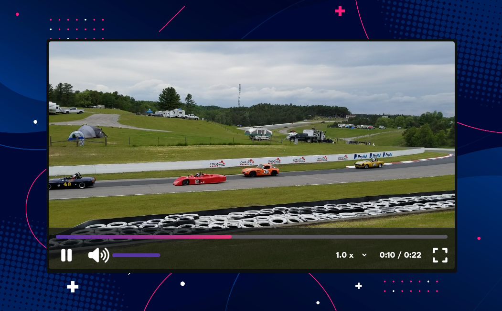

# Video Player

Custom Video Player. Control the functionality with custom UI. UI has the following components: Play/Pause button, Mute button, drag volume, progress bar, track current time, total duration, playback speed selector and fullscreen toggler.

Live - https://overdrivemachines.github.io/video-player/

## References

- HTML Audio/Video DOM - https://www.w3schools.com/tags/ref_av_dom.asp
- Change Event - https://developer.mozilla.org/en-US/docs/Web/API/HTMLElement/change_event
- Fullscreen - https://www.w3schools.com/howto/howto_js_fullscreen.asp
